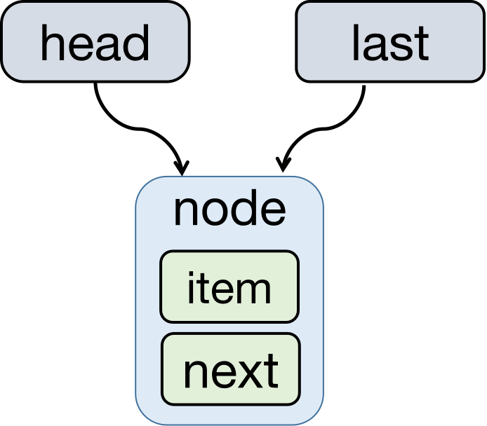
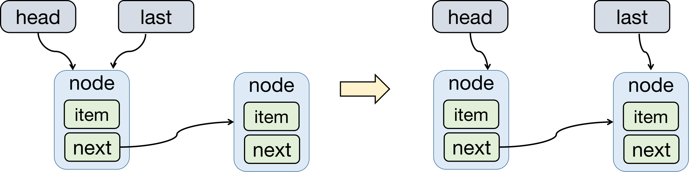
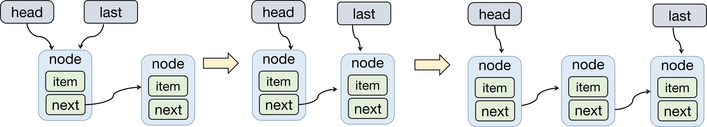
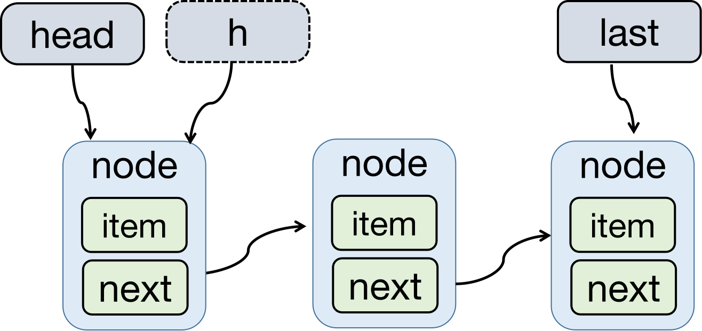
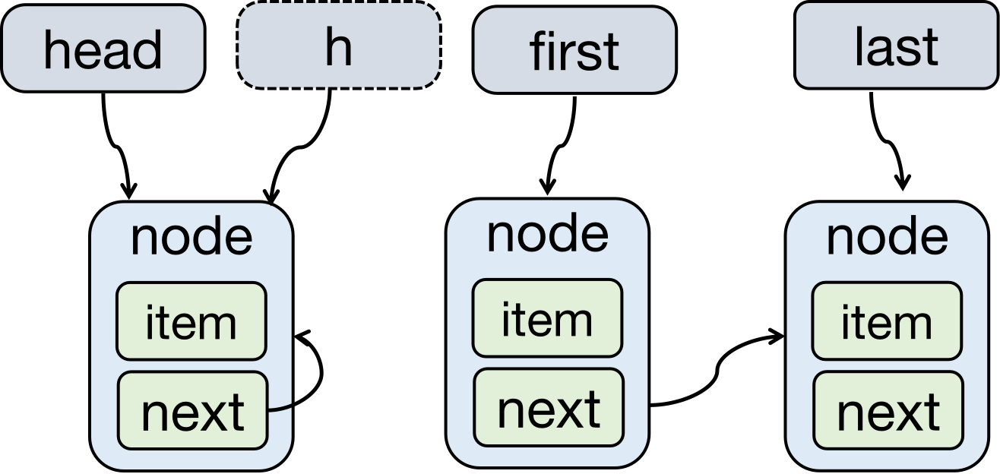
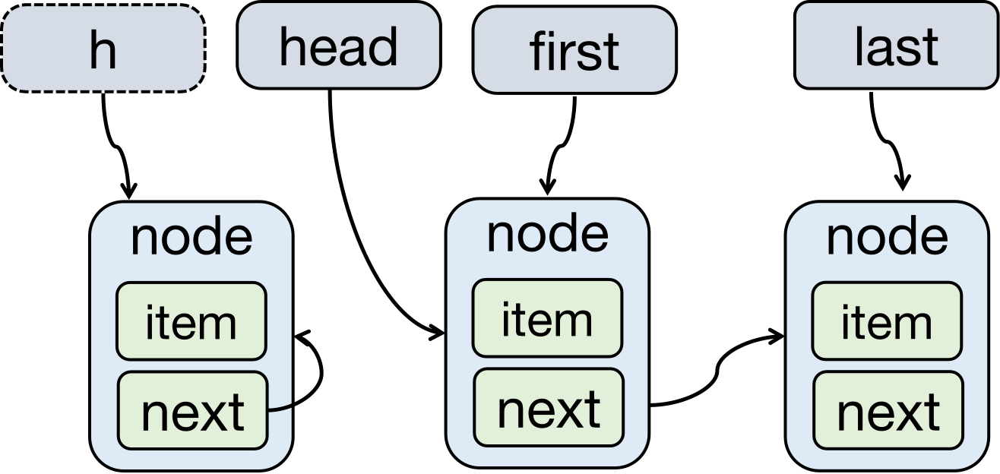
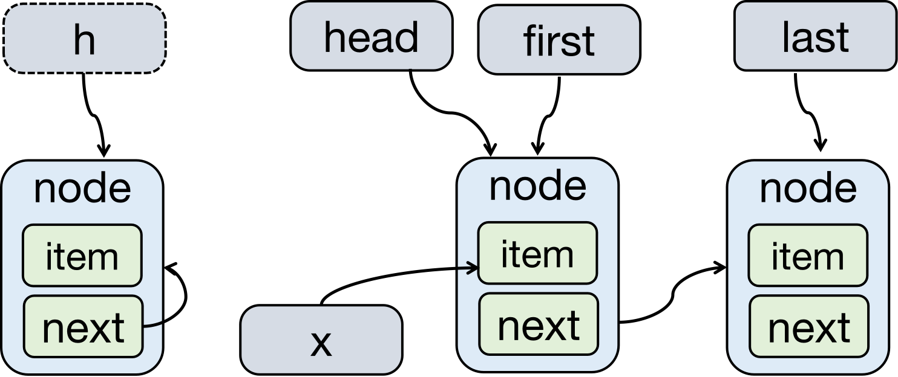

<h1><center>LinkedBlockingQueue源码解析</center></ h1>

### 前言

**@author: shg**

@create: 2020-03-27

JDK版本：11.0.12

------

### 一、LinkedBlockingQueue简介

​		LinkedBlockingQueue，以下简写**LBQ**，作者**Doug Lea**，是一个基于链表节点实现的可以选择是否有界的阻塞队列。队列的元素遵循先进先出（**FIFO**），队列的头元素在队列中的停留时间最长，尾元素最短。**新元素插入到队列的尾部，检索操作从队列的头部获取**。

### 二、LinkedBlockingQueue基础

#### 2.1 继承体系

~~~java
public class LinkedBlockingQueue<E> extends AbstractQueue<E>
        implements BlockingQueue<E>, java.io.Serializable
~~~

#### 2.2 静态内部类Node

~~~java
// 这是一个单向链表，item表示节点关联的元素，内部保存了指向下一个节点的指针next
static class Node<E> {
    E item;

    /**
     * next为下面三种情况的一种：
     * - 真正的后继节点
     * - 自己，意味着后继节点是head.next，详见出队方法dequeue()
     * - null，没有后继节点，即最后一个节点
     */
    Node<E> next;

    Node(E x) { item = x; }
}
~~~

#### 2.3 主要Fields

​		LBQ中维护了2个不同的lock（**takeLock**和**putLo**ck）分别来保证队头和队尾的线程安全和两个对应的condition（**notEmpty**和**notFull**）来实现唤醒阻塞的线程。同时还维护了一个不存储任何元素的Dummy节点**head**。最大限度的减少了竞争提高了并发度：

- take线程和put线程可以**并行执行**，
- 多个take线程之间依然串行执行
- 多个put线程之间依然串行执行

~~~java
/** 队列容量大小，或者是Integer.MAX_VALUE if none */
private final int capacity;

/** 当前元素数量，是一个原子变量 */
private final AtomicInteger count = new AtomicInteger();

/**
 * 链表的头节点.
 * 头节点的item始终为null， head.item == null
 */
transient Node<E> head;

/**
 * 链表的尾节点.
 * 尾节点的next始终为null， last.next == null
 */
private transient Node<E> last;

/** take、poll等获取操作的线程获取的锁 */
private final ReentrantLock takeLock = new ReentrantLock();

/** 等待满足获取元素条件的等待队列，用来唤醒takes操作 */
private final Condition notEmpty = takeLock.newCondition();

/** put、offer等获插入元素的线程获取的锁 */
private final ReentrantLock putLock = new ReentrantLock();

/** 等待满足插入元素条件的等待队列，用来唤醒puts操作 */
private final Condition notFull = putLock.newCondition();
~~~

#### 2.4 主要构造方法constructors

当调用LinkedBlockingQueue(int capacity)构造方法时，根据给定的容量capacity创建一个有界的阻塞队列，并且初始化队头和队尾，此时队头和队尾指向同一个节点，item和next均为null，如下图所示：



~~~java
/**
 * 创建一个容量为Integer.MAX_VALUE的阻塞队列
 */
public LinkedBlockingQueue() {
    this(Integer.MAX_VALUE);
}

/**
 * 根据给定的容量capacity创建一个有界的阻塞队列
 * 并且初始化队头和队尾，此时队头和队尾指向同一个节点，item和next均为null
 * @throws 传入参数capacity小于0会抛出异常
 */
public LinkedBlockingQueue(int capacity) {
    if (capacity <= 0) throw new IllegalArgumentException();
    this.capacity = capacity;
    last = head = new Node<E>(null);
}

/**
 * 创建一个容量为Integer.MAX_VALUE的阻塞队列
 * 然后开启遍历传入的集合，将集合元素加入到阻塞队列中
 * @throws 传入集合为null或者其中有null元素跑异常
 */
public LinkedBlockingQueue(Collection<? extends E> c) {
    this(Integer.MAX_VALUE);
    final ReentrantLock putLock = this.putLock;
    putLock.lock(); // Never contended, but necessary for visibility
    try {
        int n = 0;
        for (E e : c) {
            if (e == null)
                throw new NullPointerException();
            if (n == capacity)
                throw new IllegalStateException("Queue full");
            enqueue(new Node<E>(e));
            ++n;
        }
        count.set(n);
    } finally {
        putLock.unlock();
    }
}
~~~

#### 2.5 主要基本方法

##### 2.5.1 唤醒被阻塞的take线程方法signalNotEmpty()

~~~java
/**
 * Signals a waiting take. Called only from put/offer (which do not
 * otherwise ordinarily lock takeLock.)
 */
private void signalNotEmpty() {
    final ReentrantLock takeLock = this.takeLock;
    takeLock.lock();
    try {
        notEmpty.signal();
    } finally {
        takeLock.unlock();
    }
}
~~~

##### 2.5.2 唤醒被阻塞的put线程方法signalNotFull()

```java
/**
 * Signals a waiting put. Called only from take/poll.
 */
private void signalNotFull() {
    final ReentrantLock putLock = this.putLock;
    putLock.lock();
    try {
        notFull.signal();
    } finally {
        putLock.unlock();
    }
}
```

##### 2.5.3 入队方法enqueue()

​		将传入的节点node加入到链表的尾部，然后last指向新加入的节点：




​		继续插入节点：




~~~java
/**
 * 从队列尾部入队.
 */
private void enqueue(Node<E> node) {
    last = last.next = node;
}
~~~

##### 2.5.4 出队方法dequeue()

​		1. 首先将头节点head赋值给一个变量h



​		2. 将h的后继节点赋值给变量first（这个first指向的节点的item存储的才是队列的第一个元素）


​		3. 将h的next指针指向自己（目的是帮助GC）



​		4. 将first重新赋值给head



​		5. 将first关联的元素赋值给x（x是队列的第一个元素）



​		

​		6. 将first的item置为null（即头节点head的item始终为null）

​		7. 返回x即队列的第一个元素

~~~java
/**
 * 从队头出队
 */
private E dequeue() {
    Node<E> h = head;
    Node<E> first = h.next;
    h.next = h; // help GC
    head = first;
    E x = first.item;
    first.item = null;
    return x;
}
~~~

### 三、核心方法分析

#### 3.1 Blocks类方法：put(e)和take()

##### 3.1.1 put(e)方法分析

​		在同步代码块内，唤醒的是其他因为调用**notFull.await()**方法而被阻塞的其他**put**线程

​		出了同步代码块后，唤醒的是因为调用**notEmpty.await()**方法而被阻塞的**take**线程

​		每次唤醒都会根据**c（元素入队前队列大小）**做一次判断而且都只唤醒**1个**线程，避免了不必要的竞争

~~~java
/**
 * 从队列尾部插入元素，如果队列已满，则调用notFull.await()等待队列有剩余空间
 */
public void put(E e) throws InterruptedException {
    if (e == null) throw new NullPointerException(); // 如果加入的元素没null，则抛出异常（Doug Lea不太喜欢null😂）。
    final int c;
    final LinkedBlockingQueue.Node<E> node = new LinkedBlockingQueue.Node<E>(e);
    final ReentrantLock putLock = this.putLock;
    final AtomicInteger count = this.count;
    putLock.lockInterruptibly();
    try {
        while (count.get() == capacity) { // 如果当前队列大小已等于队列的容量上限，则说明没有空间加入新元素，阻塞当前线程
            notFull.await();
        }
        enqueue(node); //执行入队操作
        c = count.getAndIncrement(); // 将count值赋值给c之后，所以这个c是当前元素入队前队列大小，count再进行+1操作
        if (c + 1 < capacity) // c表示的是当前元素入队前的队列大小，所以c + 1是当前队列大小，c + 1 < capacity 说明队列还有空间，则唤醒任意一个因为调用notFull.await()方法而被阻塞的其他put线程。
            notFull.signal();
    } finally {
        putLock.unlock();
    }
    if (c == 0)
        signalNotEmpty(); // c表示的是当前元素入队前的队列大小，如果c == 0，那么才会有take线程因为调用notEmpty.await()方法被阻塞，才需要唤醒take线程。
}
~~~

##### 3.1.2 take()方法

​		take方法和put方法可以说是对称的，基本思想类似，详见注释。

~~~java
public E take() throws InterruptedException {
    final E x;
    final int c;
    final AtomicInteger count = this.count;
    final ReentrantLock takeLock = this.takeLock;
    takeLock.lockInterruptibly();
    try {
        while (count.get() == 0) { //对列为空，阻塞当前线程
            notEmpty.await(); 
        }
        x = dequeue(); // 执行出队操作
        c = count.getAndDecrement();
        if (c > 1)
            notEmpty.signal(); // c表示的是元素出队前的队列大小，如果c > 1，则说明此时队列中至少还有一个元素，所以唤醒其他调用notEmpty.signal方法而被阻塞的take线程
    } finally {
        takeLock.unlock();
    }
    if (c == capacity)
        signalNotFull(); //c表示的是元素出队前的队列大小，如果c == capacity，那么才会有put线程因为调用notFull.await()方法被阻塞，才需要唤醒put线程。
    return x;
}
~~~

#### 3.2 Times out类方法：offer(e, timeout,  unit) 和 poll(timeout,  unit)

##### 3.2.1 offer(e, timeout,  unit)

​		offer(e, timeout,  unit)  与 put 实现基本相同，主要区别在于offer不会一直等待，当等待超过设置的时间，队列依然没有空间加入新元素，则会返回false，否则返回true。

~~~java
public boolean offer(E e, long timeout, TimeUnit unit)
    throws InterruptedException {
    if (e == null) throw new NullPointerException();
    long nanos = unit.toNanos(timeout);
    final int c;
    final ReentrantLock putLock = this.putLock;
    final AtomicInteger count = this.count;
    putLock.lockInterruptibly();
    try {
        while (count.get() == capacity) { 
            if (nanos <= 0L) // 超过等待时间队列依然没有空间，则会返回false，不会一直等待
                return false;
            nanos = notFull.awaitNanos(nanos);
        }
        enqueue(new Node<E>(e));
        c = count.getAndIncrement();
        if (c + 1 < capacity)
            notFull.signal();
    } finally {
        putLock.unlock();
    }
    if (c == 0)
        signalNotEmpty();
    return true;
}
~~~

##### 3.2.2 poll(timeout,  unit)

​		poll(timeout,  unit)  与 teke 实现基本相同，主要区别在于poll不会一直等待，当等待超过设置的时间，队列依然为空，则会返回null。

~~~java
public E poll(long timeout, TimeUnit unit) throws InterruptedException {
    final E x;
    final int c;
    long nanos = unit.toNanos(timeout);
    final AtomicInteger count = this.count;
    final ReentrantLock takeLock = this.takeLock;
    takeLock.lockInterruptibly();
    try {
        while (count.get() == 0) {
            if (nanos <= 0L)
                return null;
            nanos = notEmpty.awaitNanos(nanos);
        }
        x = dequeue();
        c = count.getAndDecrement();
        if (c > 1)
            notEmpty.signal();
    } finally {
        takeLock.unlock();
    }
    if (c == capacity)
        signalNotFull();
    return x;
}
~~~

#### 3.3 Special value类方法：offer(e) 和poll()

##### 3.3.1 offer(e)方法

​		offer(e)  与 put(e) 实现基本相同，主要区别在于offer(e)不会阻塞，当队列已满没有空间加入新元素，则会返回false，否则返回true。

~~~java
public boolean offer(E e) {
    if (e == null) throw new NullPointerException();
    final AtomicInteger count = this.count;
    if (count.get() == capacity)
        return false;
    final int c;
    final Node<E> node = new Node<E>(e);
    final ReentrantLock putLock = this.putLock;
    putLock.lock();
    try {
        if (count.get() == capacity)
            return false;
        enqueue(node);
        c = count.getAndIncrement();
        if (c + 1 < capacity)
            notFull.signal();
    } finally {
        putLock.unlock();
    }
    if (c == 0)
        signalNotEmpty();
    return true;
}
~~~

##### 3.3.2 poll()

​		poll() 与 take 实现基本相同，主要区别在于poll()不会阻塞，当队列为空没法获取元素则直接返回null。

~~~java
public E poll() {
    final AtomicInteger count = this.count;
    if (count.get() == 0)
        return null;
    final E x;
    final int c;
    final ReentrantLock takeLock = this.takeLock;
    takeLock.lock();
    try {
        if (count.get() == 0)
            return null;
        x = dequeue();
        c = count.getAndDecrement();
        if (c > 1)
            notEmpty.signal();
    } finally {
        takeLock.unlock();
    }
    if (c == capacity)
        signalNotFull();
    return x;
}
~~~

### 四、总结

#### 4.1 方法总结（from java.util.concurrent.BlockingQueue）

<table border="1" >
    <tr align="center">
        <td colspan="5">Summary of BlockingQueue methods</td>
    </tr>
    <tr align="center">
        <th ></th>
        <th >Throws exception</th>
        <th>Special value</th>
        <th>Blocks</th>
        <th>Times out</th>
    </tr>
    <tr align="center">
    <td>Insert</td>
    <td>add(e)</td>
    <td>offer(e)</td>
    <td>put(e)</td>
    <td>offer(e, time, unit)</td>
    </tr>
    <tr align="center">
    <td>Remove</td>
    <td>remove</td>
    <td>poll()</td>
    <td>take()</td>
    <td>poll(time, unit)</td>
    </tr>
    <tr align="center">
    <td>Examine</td>
    <td>element</td>
    <td>peek()</td>
    <td>not applicable</td>
    <td>not applicable</td>
    </tr>
</table>

#### 4.2 使用注意事项

​		在使用LinkedBlockingQueue时，应指定参数，否则默认容量为Integer.MAX_VALUE。

#### 4.3 核心思想

​		1.初始化链表的时候，使用一个Dummy节点用来占位，其内部的item始终为null。

​		2.内部维护了两把锁实现了take和put并发。